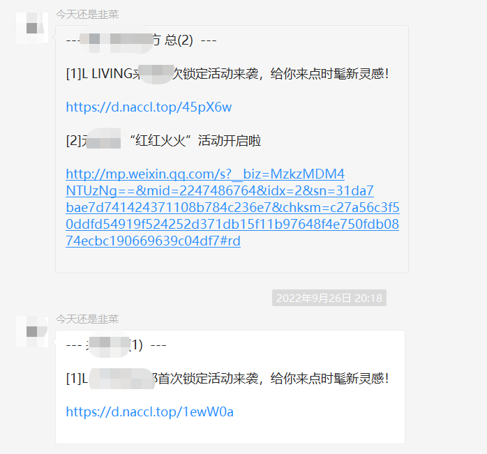
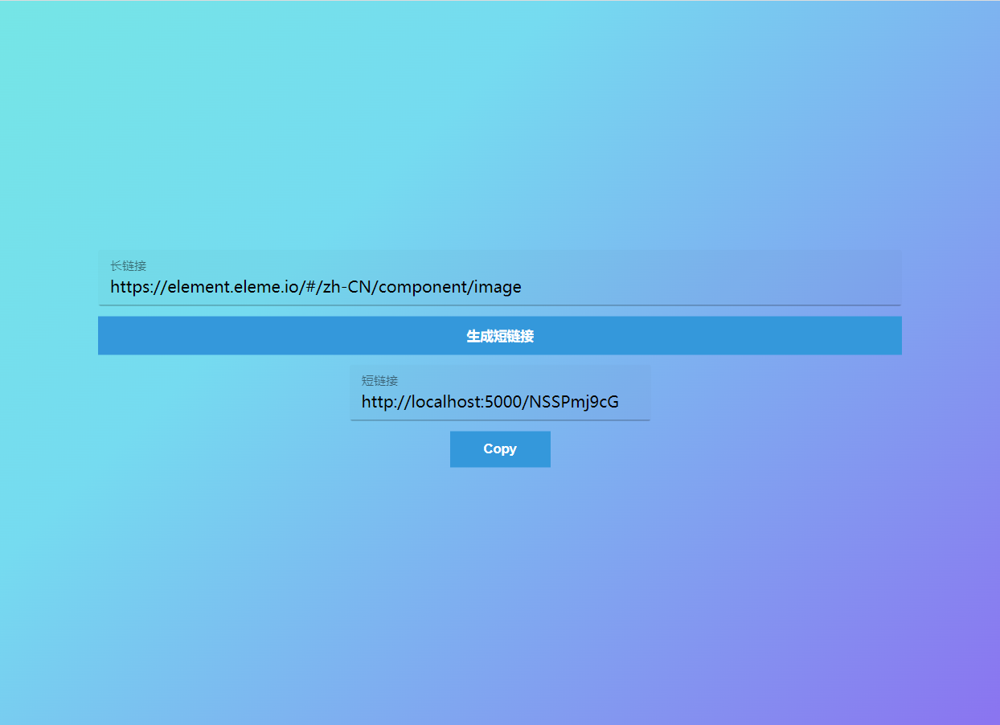

# 短链接生成

url长链接转化为短链接

由于之前做过微信采集文章助手由于文章链接超长而想过自己实现一个短链接生成器,之前是采用了免费的短链接生成器由于存在次数限制,所以只做了首条数据处理短链接,保证信息的实时推送



本次项目主要技术

```
 // 依赖文件
 "config": "^3.2.2", // 获取config文件配置
 "express": "^4.17.1",	// 搭建本地服务器
 "mongoose": "^5.6.9",	// 连接mongodb
 "shortid": "^2.2.14",	// 短链接id生成
 "valid-url": "^1.0.9"	// 校验url地址
```

项目图片




搭建项目参考链接

[mongodb下载安装教程](https://blog.csdn.net/baidu_39298625/article/details/98592631?spm=1001.2101.3001.6650.2&utm_medium=distribute.pc_relevant.none-task-blog-2%7Edefault%7ECTRLIST%7ERate-2-98592631-blog-118633286.pc_relevant_recovery_v2&depth_1-utm_source=distribute.pc_relevant.none-task-blog-2%7Edefault%7ECTRLIST%7ERate-2-98592631-blog-118633286.pc_relevant_recovery_v2&utm_relevant_index=3 )

[短链接参考](https://cloud.tencent.com/developer/article/1492175?from=article.detail.1858351)
